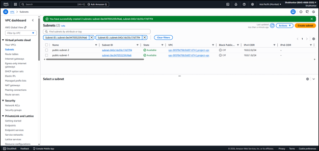
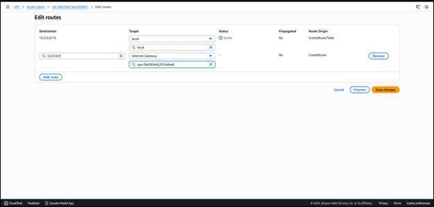
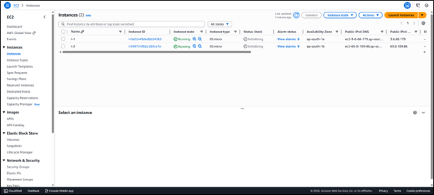
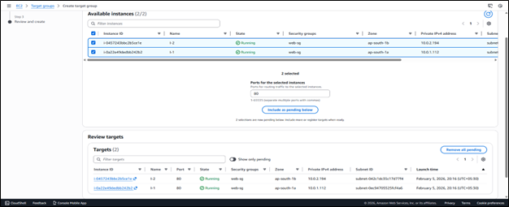
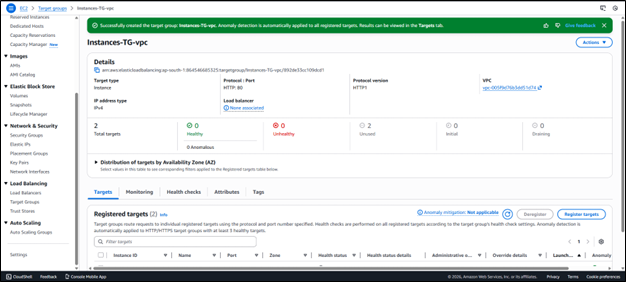
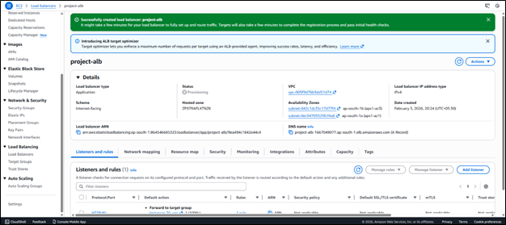
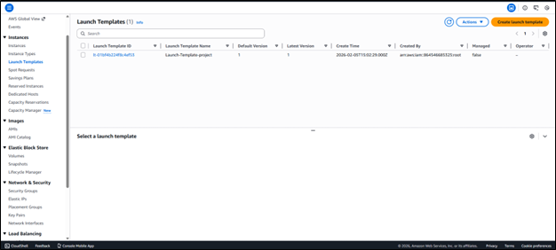
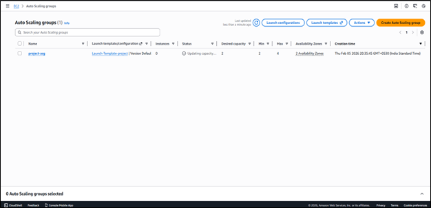
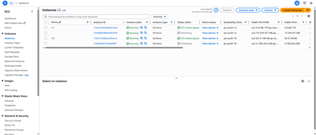

# aws-vpc-elb-autoscaling
This project demonstrates the design and implementation of a highly available and scalable AWS infrastructure using a custom VPC, public subnets across multiple Availability Zones, Application Load Balancer, and Auto Scaling Group to host Linux-based web servers.

# Architecture

<p align="center">
  
</p>

## 📋 Requirements
- Create a custom VPC  
- Create 2 public subnets in different Availability Zones  
- Launch Linux EC2 instances  
- Create Target Group  
- Create Application Load Balancer  
- Create Launch Template / Launch Configuration  
- Create Auto Scaling Group  

---

## 🌐 VPC

➢ Open AWS Console → Navigate to `VPC` → Create VPC → Select `VPC only`  
→ Name: `project-vpc`  
→ IPv4 CIDR block: `10.0.0.0/16`  
→ Create VPC  

<p align="center">
  
</p>

➢ Navigate to `Internet Gateways` → Create Internet Gateway  
→ Name: `project-igw`  
→ Attach Internet Gateway to `project-vpc`

<p align="center">
  
</p>

---


## 🗂 Subnets

➢ Navigate to `Subnets` → Create Subnet  
→ VPC: `project-vpc`  

`Public Subnet 1`  
→ Name: `public-subnet-1`  
→ Availability Zone: `ap-south-1a`  
→ CIDR: `10.0.1.0/24`  

`Public Subnet 2`  
→ Name: `public-subnet-2`  
→ Availability Zone: `ap-south-1b`  
→ CIDR: `10.0.2.0/24`


<p align="center">
  
</p>

---

## 🛣 Route Table

➢ Navigate to `Route Tables` → Create Route Table  
→ Name: `public-rt`  
→ VPC: `project-vpc`  

➢ Edit Routes  
→ Destination: `0.0.0.0/0`  
→ Target: Internet Gateway (`project-igw`)  

➢ Associate both public subnets with `public-rt`

<p align="center">
  
</p>


---

## 🔐 Security Group

➢ Navigate to `EC2 → Security Groups` → Create Security Group  
→ Name: `web-sg`  
→ VPC: `project-vpc`

`Inbound Rules`
- HTTP → Port 80 → Source: `0.0.0.0/0`
- SSH → Port 22 → Source: `My IP`

---

## 🖥 EC2 Instances

➢ Navigate to `EC2` → Launch Instance  
→ Name: `WebServer`  
→ AMI: Amazon Linux 2  
→ Instance Type: `t3.micro`  
→ Key Pair: Select existing key  
→ Network: `project-vpc`  
→ Subnet: Public Subnet  
→ Security Group: `web-sg`  
→ Launch instance  

➢ Repeat the same steps to launch a second instance in another public subnet (different AZ)

### User Data Script
```bash
#!/bin/bash
yum install -y httpd
systemctl start httpd
systemctl enable httpd
echo "<h1>Server from $(hostname)</h1>" > /var/www/html/index.html
```

<p align="center">
  
</p>

---

## 🎯 Target Group

➢ Navigate to `EC2 → Target Groups → Create Target Group`  
→ Target type: `Instances`  
→ Protocol: `HTTP`  
→ Port: `80`  
→ VPC: `project-vpc`

➢ Register both EC2 instances  
→ Create Target Group

<p align="center">
  
</p>

<p align="center">
  
</p>

---

## ⚖ Application Load Balancer

➢ Navigate to `EC2 → Load Balancers → Create Load Balancer`  
→ Select `Application Load Balancer`  
→ Name: `project-alb`  
→ Scheme: `Internet-facing`  
→ IP type: `IPv4`

➢ Select VPC and both public subnets  
➢ Assign Security Group: `web-sg`  
➢ Listener: `HTTP` → Port 80 → Forward to Target Group`

➢ Copy Load Balancer DNS and test in browser


<p align="center">
  
</p>
---

## 🚀 Launch Template

➢ Navigate to `EC2 → Launch Templates → Create Launch Template`  
→ Name: `project-launch-template`  
→ AMI: `Amazon Linux 2`  
→ Instance type: `t3.micro`  
→ Security Group: `web-sg`
➢ Add the same user data script  
→ Create Launch Template


<p align="center">
  
</p>
---

## 🔁 Auto Scaling Group

➢ Navigate to `Auto Scaling Groups → Create Auto Scaling Group`  
→ Name: `project-asg`  
→ Select Launch Template

➢ Select VPC and both public subnets  
➢ Attach to existing Load Balancer  
→ Select Target Group

### Group Size
- Minimum: `2`
- Desired: `2`
- Maximum: `4`

### Scaling Policy
- `Target Tracking`
- `Average CPU Utilization: 50%`

<p align="center">
  
</p>

---

## 🧪 Testing

➢ Open Load Balancer DNS in browser  
→ Refresh multiple times → Traffic distributed across EC2 instances

➢ SSH into an instance and run:
```bash
sudo yum install -y stress
stress --cpu 2 --timeout 300
```

<p align="center">
  
</p>


## ✅ Conclusion

- Successfully created a highly available and scalable AWS architecture using a custom VPC, public subnets across multiple Availability Zones, Application Load Balancer, and Auto Scaling Group.
- This architecture ensures fault tolerance, efficient load distribution, and automatic scaling based on traffic demand.
